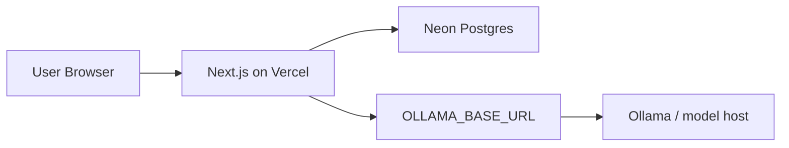

# Atomix V1 Deployment Notes

## Current V1 shape

Atomix now models projects as long-lived Security Project Records (`SPR`) and reviews/pentests as dated Security Records (`SR`):

- `Project` = SPR / application portfolio record.
- `SecurityReview` = SR / dated pentest or security review.
- `ReviewWorkstream` = frontend, backend, API, MSB, LLM, or similar review stream.
- `ScopeProfile` = app risk/scoping profile.
- `Component` = sub-project, app component, API, service, frontend, backend, or LLM surface.
- `ReviewerProfile` + `ReviewerAssignment` = pentester capacity and active assignments.
- `ReviewExtension` / `ReviewCancellation` = manager-visible workflow exceptions.

## Recommended live architecture



## Database

The app is still configured for SQLite locally so the current UI remains reviewable.

For production V1, use Neon Postgres:

1. Create a Neon project/database.
2. Set `DATABASE_URL` in Vercel.
3. Switch `prisma/schema.prisma` datasource provider from `sqlite` to `postgresql`.
4. Recreate a clean Postgres migration baseline before running production migrations.
5. Run `npx prisma migrate deploy` in CI/Vercel build flow or a controlled release step.

Do not use a laptop-hosted database for production. If the laptop sleeps, the live app fails.

## LLM

Ollama is now environment-driven:

- `OLLAMA_BASE_URL`
- `OLLAMA_MODEL`

Safe V1 options:

1. Use a hosted LLM API later.
2. Run Ollama on a small always-on VPS.
3. Temporarily expose your machine with Cloudflare Tunnel or Tailscale Funnel.

If using your machine for Ollama, keep the DB on Neon. The app should remain usable when the LLM endpoint is offline.

## Local UI review

After migrations:

```bash
npm run backfill:spr-sr
npm run dev
```

Review these pages:

- `/projects` for SPR portfolio.
- `/projects/[id]` for SPR detail, SR history, scope, components, and finding versions.
- `/reviews` for pentest manager SR command center.
- `/reviewers` for pentester availability and assignments.

## Known production hardening items

- Add organization/tenant scoping before multi-tenant launch.
- Replace string workflow states with controlled constants or enums once flows stabilize.
- Add background jobs for AI analysis rather than long-running Vercel requests.
- Add audit logs for assignment, extension, cancellation, exception, and remediation actions.
- Add RBAC checks per route/action, not only sidebar visibility.
